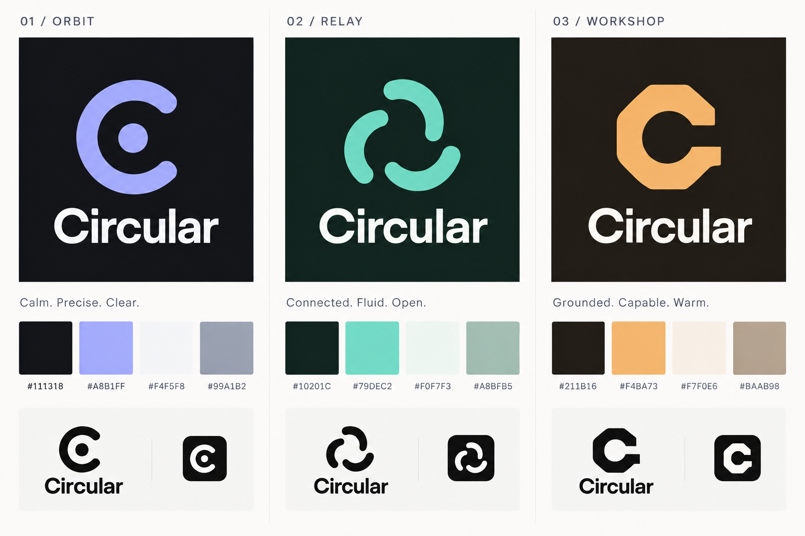

# Circular brand

Approved on 2026-10-03. Circular uses the **Orbit** identity: an open circular
**C with a centered dot**, a graphite and periwinkle palette, and **Geist**
typography. Use this guide for the public site, console, documentation, and
integration avatars.

## Brand idea

Circular should feel **calm, precise, and clear**. It brings tasks, coding agents,
and review into one visible workflow so people can follow the work and decide
what ships.

The product name is **Circular**. Orbit names the visual direction; it is not a
second product name.

The main message is:

> Your agents. One clear workflow.

For a short product description, use **A self-hosted workspace for coding agents.**

## Logo

The mark is a circular arc forming a C, open to the right, with rounded terminals
and a single solid dot **inside the C**. Center the dot on the circle described
by the arc, horizontally and vertically. The dot and arc share one color.

The centered dot follows the existing vitrine mark. Preserve this placement in
every version, including small icons. The earlier concept with a dot in the
right-hand opening is superseded.

- Pair the mark with the title-case wordmark **Circular** in full logo layouts.
- Use the mark alone for favicons and integration avatars.
- Preserve the mark's proportions and keep the dot visibly separate from the arc
  at small sizes.
- Use a single flat color: periwinkle on graphite, or a monochrome version with
  clear contrast against its background.
- Keep surrounding space clear so the mark remains legible alongside text and
  other icons.

The [vitrine favicon](../apps/vitrine/icon.svg) and the inline marks in the
[vitrine page](../apps/vitrine/index.html) are the existing geometry references.
Use editable SVG assets for production; the concept sheet below illustrates the
direction.

## Color palette

These values define the agreed palette. Use the hex values in this table as the
color reference rather than sampling the generated concept image.

| Role | Name | Hex | Use |
| --- | --- | --- | --- |
| Background | Graphite | `#111318` | Main dark brand surface |
| Brand accent | Periwinkle | `#A8B1FF` | Logo, key actions, selected states, and focused emphasis |
| Main text | Porcelain | `#F4F5F8` | Primary text on graphite |
| Secondary text | Cool gray | `#99A1B2` | Supporting text and metadata on graphite |

Let graphite and porcelain carry most of the layout. Use periwinkle sparingly to
guide attention. Use graphite text on a filled periwinkle button. Keep success,
warning, and error colors tied to their respective meanings rather than using
them as decorative brand accents.

## Typography

Use **Geist**, already bundled in the console and vitrine, for the wordmark,
headings, interface labels, and body text. Use medium weight for the wordmark and
headings, and regular weight for longer copy. Keep spacing and hierarchy clear;
reserve monospace styling for code and technical identifiers.

## Voice

Write direct, concrete sentences. Explain what people can do, what the agent is
doing, and what they can review. Prefer familiar verbs such as **Assign**,
**Follow**, and **Review**. For example:

> Give coding agents a task. Follow their progress, inspect the changes, and
> decide what ships.

Keep product terminology consistent with the [domain model](../CONTEXT.md),
especially the distinction between an Agent, a Task, and a Run.

## Visual reference

The **left-hand Orbit column** in this revised concept sheet records the selected
direction, including the centered dot in the large mark and small icons. Relay
and Workshop remain exploration alternatives and are not part of the identity.

## Adoption status

The vitrine already uses the centered-dot C and Geist. Its existing
[stylesheet](../apps/vitrine/site.css) uses an earlier palette, including
`#0B0D10` for the background and `#B4BDFF` for the accent. The table above records
the agreed target colors; aligning the site and console tokens is a separate
implementation step.

Use the console's shared theme when applying these colors, as described in
[console components](development/ui-components.md).
